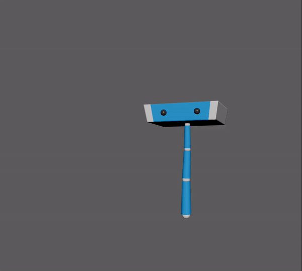
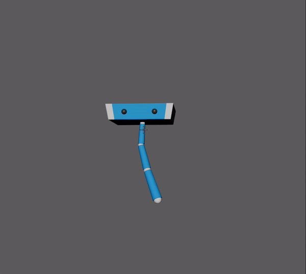

# keychain
Python framework for intuitive animation scripting in Maya.

### About ###

Keychain is a wrapper around Maya's python api that aims to simplify
the learning curve for artists who wish to get into scripting, as well to
provide them with the type of utility methods commonly present in
animation/vfx studios.

This is why keychain's is built to be: Modular, fast and readable.

The [tools](python/keychain/tools) provide
some examples of how to use the api

_______

### How to Install ###
#### Windows ####
[Get the latest release](releases)

Or for the latest build:
1. git clone git

2. Copy the python/keychain folder to your maya 'scripts' folder or
[add it to your python path](https://knowledge.autodesk.com/support/maya/learn-explore/caas/CloudHelp/cloudhelp/2016/ENU/Maya/files/GUID-C0F27A50-3DD6-454C-A4D1-9E3C44B3C990-htm.html).

3. Copy the [icons folder](icons) to your
icons folder or add it to your [XBMLANGPATH](https://knowledge.autodesk.com/support/maya/learn-explore/caas/CloudHelp/cloudhelp/2016/ENU/Maya/files/GUID-228CCA33-4AFE-4380-8C3D-18D23F7EAC72-htm.html).

## Tools ##
### Archer ###
As an alternative to motion-paths, this will key the selected nodes along a drawn path without the use of constraints.  

### Tracer ###
Drawing based approach for posing in screen-space. Works with IK/FK or any free transforms.

## API ##
